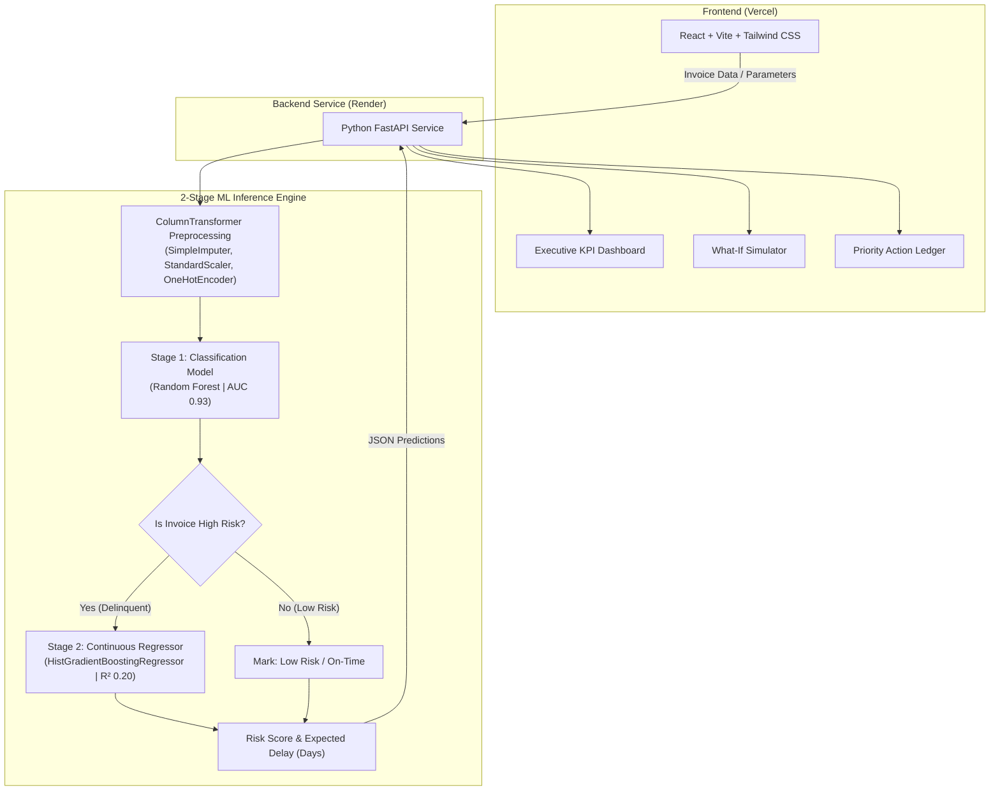

# Accounts Receivable Risk Engine & Predictive Dashboard

An end-to-end predictive analytics dashboard built to help finance teams monitor cash flow and reduce credit default risk. Using a two-stage machine learning pipeline, the application evaluates invoice payment delays, estimates overall financial exposure, and helps prioritize collections.

* Live Dashboard: [https://accounts-receivable-ml.vercel.app](https://accounts-receivable-ml.vercel.app)
* Backend API: [https://accounts-receivable-s4wd.onrender.com](https://accounts-receivable-s4wd.onrender.com)

---

## Architecture Flow


---

## What It Does

* **Executive Overview:** Tracks total outstanding balance, predicted default risk, average risk scores, and total active invoices.
* **Two-Stage ML Model:**
  * **Classification:** Calculates the likelihood of an invoice being paid late or defaulting.
  * **Regression:** Predicts the exact number of days payment will be delayed and the resulting financial impact.
* **What-If Simulator:** Allows users to adjust payment terms, credit limits, and delay parameters to test different risk scenarios in real time.
* **Collections Ledger:** Automatically sorts accounts by risk level and value so collectors know which clients to contact first.
* **REST API Integration:** Connects a React frontend with a FastAPI backend service for quick data fetching and inference.

---

## Tech Stack

### Frontend
* React (Vite)
* Tailwind CSS
* Hosted on Vercel

### Backend & Machine Learning
* FastAPI (Python)
* Scikit-Learn (Random Forest & HistGradientBoosting)
* Pandas & NumPy
* Hosted on Render

---

## Local Development Setup

### Prerequisites
* Node.js (v18+)
* Python 3.9+
* Git

---

### 1. Clone the Repository
```bash
git clone https://github.com/sajesh-nair/accounts_receivable.git
cd accounts_receivable
```

### 2. Backend Setup
```bash
cd backend

# Create and activate environment
python -m venv venv

# Windows:
venv\Scripts\activate

# macOS/Linux:
source venv/bin/activate

# Install requirements
pip install -r requirements.txt

# Run server
uvicorn main:app --reload
```
The API will run locally at `http://localhost:8000`.

### 3. Frontend Setup
```bash
# Open a new terminal tab/window
cd frontend

# Install dependencies
npm install

# Start dev server
npm run dev
```
Open `http://localhost:5173` in your browser.
